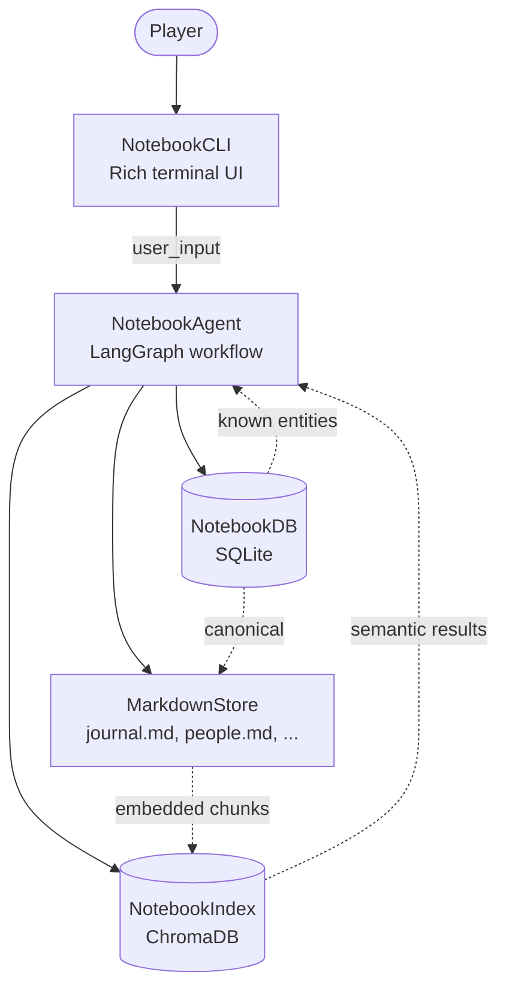
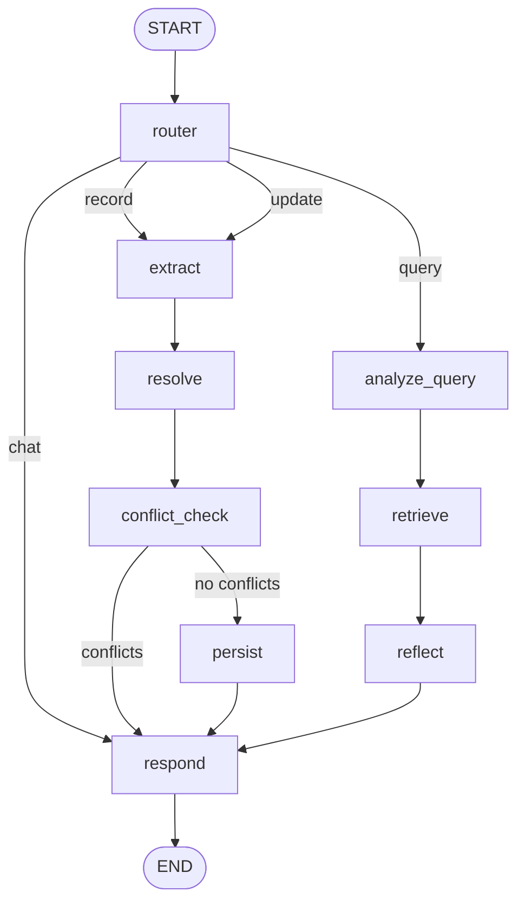
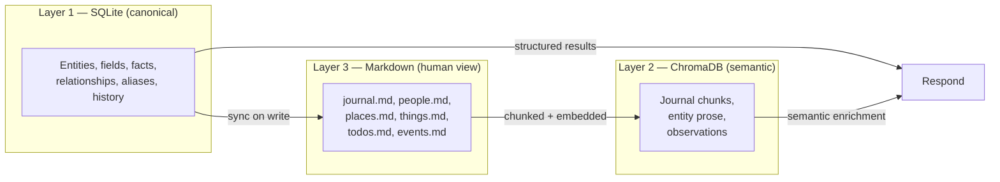
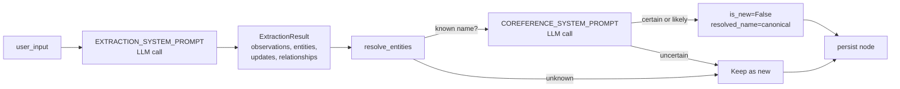
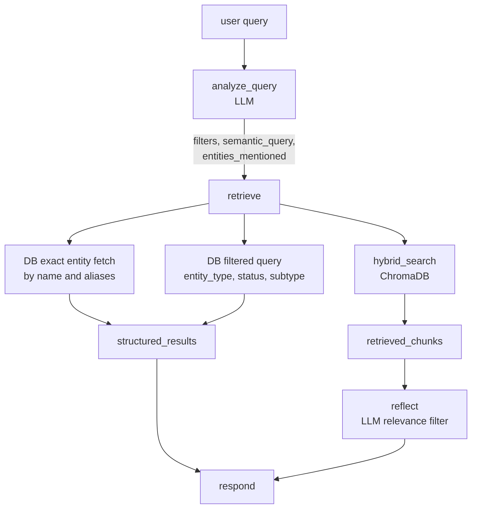

# Game Notebook — Architecture

A technical architecture overview of the codebase for developers extending or maintaining the system.

---

## 1. System Overview



The CLI is the only entry point. It owns the input loop and the slash commands. The agent is invoked once per user turn; everything else is plumbing the agent uses to fulfil that turn.

---

## 2. Component Responsibilities

**NotebookAgent** (`src/agent/graph.py`) — wraps the compiled LangGraph workflow. Owns the state shape for a single turn, drives the graph from the user's input through to the final reply, and persists conversation history via `MarkdownStore.append_conversation` after each turn. Constructed once at startup with references to DB, store, and index.

**NodeFactory** (`src/agent/nodes.py`) — builds the per-node functions that the graph wires together. Each factory method closes over the LLM and storage handles and returns a function taking `NotebookState` and returning a partial state update. Also contains all LLM system prompts as module-level constants. Centralizing construction here keeps `graph.py` purely structural.

**NotebookDB** (`src/storage/db.py`) — SQLite wrapper. Authoritative store for entities, fields, relationships, facts (provenance), aliases, history, and reflections. Handles schema bootstrap, case-insensitive lookups, alias resolution, conflict detection, and stats. Idempotent on `(name, type)` for entity inserts and on `(entity_id, field)` for field upserts. Every field write produces a `facts` row.

**MarkdownStore** (`src/storage/markdown.py`) — Markdown rendering and parsing. Writes entities into the appropriate `.md` file (`people.md`, `places.md`, `things.md`, `todos.md`, `events.md`), appends to the chronological `journal.md`, parses files into chunks for embedding, and maintains the JSONL conversation log under `.history/`.

**NotebookIndex** (`src/storage/index.py`) — ChromaDB wrapper. Embeds markdown chunks, keeps an MD5 hash file (`notebook/.index/hashes.json`) so unchanged chunks are skipped on re-index, removes orphans on full reindex, and exposes both metadata-filtered and semantic search via `hybrid_search`. Supports local sentence-transformers and OpenAI embeddings.

**EntityExtractor** (`src/extraction/entities.py`) — LLM-driven extractor. Produces an `ExtractionResult` containing observations, entities, updates, and relationships in structured form. Also resolves coreference: for each new entity name that collides with a known one, an LLM disambiguation pass decides whether to merge with the canonical entity or keep as new.

**NotebookCLI** (`src/cli/interface.py`) — Rich terminal frontend. Renders the banner, stats, restored history (last 20 messages), agent replies (plum1 Markdown), and dispatches slash commands. Calls `NotebookAgent.chat` for every non-command line.

---

## 3. LangGraph Workflow

### Node list

```
router · extract · resolve · conflict_check · analyze_query · retrieve · reflect · persist · respond
```

### Graph structure



Two conditional edges drive routing:

- `route_by_intent(state) -> "record" | "query" | "update" | "chat"` — reads `state["intent"]`, defaulting to `"chat"`
- `route_after_conflict_check(state) -> "persist" | "respond"` — returns `"respond"` if `state["conflicts"]` is non-empty, otherwise `"persist"`

---

## 4. State Schema

`src/agent/state.py`:

```python
class NotebookState(TypedDict, total=False):
    messages: list[BaseMessage]
    user_input: str
    intent: Literal["record", "query", "update", "chat"] | None

    extracted_observations: list[str]
    extracted_entities: list[dict]
    extracted_updates: list[dict]
    extracted_relationships: list[dict]

    resolved_entities: list[dict]
    conflicts: list[dict]

    query_filters: dict | None
    semantic_query: str | None
    structured_results: list[dict]
    retrieved_chunks: list[dict]

    response: str
    files_modified: list[str]
    error: str | None
```

All fields are optional (`total=False`); each node populates only the slice it owns. The `analyze_query` node additionally writes a private `_entities_mentioned` key (leading underscore) that the `retrieve` node reads for named-entity DB lookups.

---

## 5. Three Storage Layers

The system deliberately separates three storage layers, each with a single role.



### The golden rule

> If a value supports equality tests, filters, joins, or state transitions — it belongs in the database. If it helps answer "what feels related?" — it belongs in the vector store. The markdown is the human-readable rendering of the database.

DB and markdown are kept in sync on every write. The vector index is rebuilt from the markdown via content-hash-tracked upserts.

---

## 6. SQLite Schema

Seven tables, all created by `NotebookDB.__init__` if absent.

```sql
CREATE TABLE entities (
    id          INTEGER PRIMARY KEY AUTOINCREMENT,
    name        TEXT NOT NULL,
    type        TEXT NOT NULL,  -- characters|locations|items|todos|events
    status      TEXT,
    created_at  TEXT NOT NULL,
    updated_at  TEXT NOT NULL,
    UNIQUE(name, type)
);

CREATE TABLE aliases (
    entity_id   INTEGER NOT NULL REFERENCES entities(id) ON DELETE CASCADE,
    alias       TEXT NOT NULL,
    PRIMARY KEY (entity_id, alias)
);

CREATE TABLE entity_fields (
    entity_id   INTEGER NOT NULL REFERENCES entities(id) ON DELETE CASCADE,
    field       TEXT NOT NULL,
    value       TEXT NOT NULL,
    PRIMARY KEY (entity_id, field)
);

CREATE TABLE relationships (
    from_id     INTEGER NOT NULL REFERENCES entities(id) ON DELETE CASCADE,
    to_name     TEXT NOT NULL,       -- free string, not a FK
    relation    TEXT NOT NULL,
    asserted_at TEXT NOT NULL,
    PRIMARY KEY (from_id, to_name, relation)
);

CREATE TABLE facts (
    id          INTEGER PRIMARY KEY AUTOINCREMENT,
    entity_id   INTEGER NOT NULL REFERENCES entities(id) ON DELETE CASCADE,
    field       TEXT NOT NULL,
    old_value   TEXT,
    new_value   TEXT NOT NULL,
    source      TEXT NOT NULL DEFAULT 'player_observed',
    confidence  TEXT NOT NULL DEFAULT 'certain',
    asserted_at TEXT NOT NULL,
    turn_text   TEXT
);

CREATE TABLE entity_history (
    id          INTEGER PRIMARY KEY AUTOINCREMENT,
    entity_id   INTEGER NOT NULL REFERENCES entities(id) ON DELETE CASCADE,
    note        TEXT NOT NULL,
    recorded_at TEXT NOT NULL
);

CREATE TABLE reflections (
    id          INTEGER PRIMARY KEY AUTOINCREMENT,
    category    TEXT NOT NULL,
    note        TEXT NOT NULL,
    created_at  TEXT NOT NULL
    -- reserved; not currently written by any code path
);
```

`to_name` in `relationships` is intentionally a free string, not a foreign key, so a relationship can be asserted to an entity that doesn't yet exist in the DB.

---

## 7. Markdown File Format

### Frontmatter

```yaml
---
type: <entity type>
description: <brief description>
---
```

### Entity section

```markdown
## Entity Name
**Status:** active | open | resolved | completed | answered | unknown
**Location:** where it is (if applicable)
**Role:** what they do (for characters)
**Category:** item or event category
**Explored:** yes | partial | no
**Position:** spatial relationship
**Parent:** [[ContainingPlace]]
**Subtype:** quest | plan | mystery (for todos)
**Outcome:** how/why it was resolved
**Date:** YYYY-MM-DD
**Related:** [[EntityName]], [[OtherEntity]]

- Free-text bullet details

### YYYY-MM-DD
- Timestamped history entries (appended on updates)
```

### Journal format

`journal.md` is append-only and always written directly (not rendered from the DB):

```markdown
## Session — YYYY-MM-DD HH:MM
- Observation one
- Observation two
```

---

## 8. ChromaDB

**Embeddings.** Configurable:

- `local` — sentence-transformers `all-MiniLM-L6-v2` (default)
- `openai` — `text-embedding-3-small`

**Chunk format.** One chunk per `##` entity section in any markdown file, plus one chunk per `## Session — ...` header in the journal.

**Chunk IDs.** `<filename>::<entity_name>` (e.g. `people.md::Roger`). Stable across re-indexes, enabling targeted upsert and orphan deletion.

**Metadata.** Stored on every chunk for filtered queries:

```python
{
    "file": "people.md",
    "entity_name": "Roger",
    "entity_type": "characters|locations|items|todos|events",
    "status": "open|in-progress|blocked|completed|answered|...",
    "location": "...",          # if present
    "related": "Name1,Name2",   # comma-separated if present
    "subtype": "quest|plan|mystery",  # for todos, via extra metadata
}
```

**Hash tracking.** `notebook/.index/hashes.json` maps chunk ID → MD5 of content. On `index_file`, chunks whose content hash is unchanged are skipped. On `index_all`, orphan chunks (files removed or renamed) are deleted.

**Top-k policy.** Pure metadata-filter queries use `top_k=30`; semantic queries use `top_k=10`.

---

## 9. Entity Extraction Pipeline



The extractor receives `known_entities` (type → name list) from `NotebookDB.get_known_entities()` so it can decide whether a mention collides with a canonical entity.

### Critical extraction rules

- New people, locations, and items are always extracted with `is_new: true` — never silently dropped, including items mentioned only as prerequisites.
- Dependency chains ("I need X to do Y") produce: every entity in the chain extracted; `requires` set on the dependent todo; `status: blocked` set on the dependent todo.
- Blocker / constraint statements are classified as `record` intent by the router, not `chat`.

---

## 10. Coreference Resolution

`EntityExtractor.resolve_entities` iterates over each extracted entity where `is_new=True`:

```
for each entity:
    if name not in known_entities[type]:
        # genuinely new — skip coreference
        keep is_new=True; resolved_name = name
    else:
        # name collision — disambiguate via LLM
        result = resolve_coreference(name, type, context)
        if result.confidence in ("certain", "likely"):
            is_new = False
            resolved_name = result.resolved_to   # canonical
        else:
            keep is_new=True   # treat as new entity
```

`resolve_coreference` returns:

```json
{ "resolved_to": "EntityName", "confidence": "certain|likely|uncertain", "reasoning": "..." }
```

`get_entity_by_name` does case-insensitive lookup and also tries the `aliases` table. The `aliases` table is not currently written by the resolve pipeline — it is wired for lookup but alias rows must be inserted manually or via a future code path.

---

## 11. Conflict Detection

`NotebookDB.detect_conflicts(updates)` only flags a conflict when the extractor produced an **explicit** `old_value` that disagrees with the current DB state.

```python
for update in updates:
    current = get_field(update.entity, update.field)
    if current is None:
        continue                                  # field absent — no conflict
    if not update.old_value:
        continue                                  # no asserted prior — no conflict
    if current.lower() == update.new_value.lower():
        continue                                  # re-stating current — no conflict
    if current.lower() == update.old_value.lower():
        continue                                  # asserted prior matches — normal update
    conflicts.append({...})
```

When `conflicts` is non-empty, the graph routes `conflict_check → respond` instead of persisting. The reply describes the discrepancy and waits for confirmation on the next turn.

---

## 12. Retrieval Strategy

The retrieve node is hybrid: structured (DB) first, semantic (ChromaDB) second, then an LLM relevance filter.



- `analyze_query` (LLM) produces `semantic_query`, `query_filters` (`entity_type`, `status`, `subtype`), and `_entities_mentioned`. Status filters are populated only when explicitly requested. Access codes / passwords / combinations route to `entity_type=items`.
- `hybrid_search`: with no `semantic_query`, runs a pure metadata-filter query (`top_k=30`); with a `semantic_query`, runs semantic search with optional metadata filters (`top_k=10`).
- `reflect` (LLM) is given `{id, summary}` pairs and returns only the IDs that are genuinely relevant. On JSON parse failure it passes all chunks through.
- The respond prompt receives DB rows first (authoritative) and semantic chunks second (enrichment), preventing semantic recall from overriding canon facts.

---

## 13. Completion Propagation

When the persist node sees a todo transition to `completed` or `answered`:

1. Look up entities listed in the todo's `related` field.
2. Find related items whose status is in `{lost, not obtained, not recovered, unknown}`.
3. Update those items' status to `found` in both the DB and the markdown.
4. If the extractor did not produce an `outcome` for the completed todo, synthesize one from the raw `user_input` and write it to DB and markdown.

---

## 14. Respond Node — Contextual Enrichment

For `record` and `update`, the respond node:

1. Collects entity names from `resolved_entities` and `extracted_updates`.
2. Fetches those entities from the DB (exact fields, status, relationships).
3. Runs semantic search over journal/observations per entity name (top 3, deduped).
4. Runs an additional semantic search filtered to `entity_type=todos, status=open` to surface unblocked steps.
5. When `intent=record` and new entities were recorded, builds a compact entity list and injects it into the prompt. If a **consequential** fact is missing (unknown allegiance on a quest-relevant character, unknown item category), the LLM appends one short clarifying question. The user's reply on the next turn is processed as normal input — no special routing, no dedicated state fields.

For `query` intent: semantic chunks whose entity name is already in `structured_results` are treated as enrichment only.

The system prompt (`NOTEBOOK_SYSTEM_PROMPT`) enforces memory-only behavior: no advice or strategy, concise second-person tone, never mentions files or internal mechanics.

---

## 15. Configuration

Loaded from `.env` at startup. Defaults shown.

| Variable             | Default                      | Description                                   |
|----------------------|------------------------------|-----------------------------------------------|
| `NOTEBOOK_PATH`      | `./notebook`                 | Where game data lives                         |
| `LLM_PROVIDER`       | `openai`                     | `openai` or `anthropic`                       |
| `OPENAI_MODEL`       | `gpt-4o`                     | OpenAI chat model                             |
| `ANTHROPIC_MODEL`    | `claude-sonnet-4-20250514`   | Anthropic chat model                          |
| `EMBEDDING_PROVIDER` | `local`                      | `local` (sentence-transformers) or `openai`   |

LLM temperature is fixed at `0.7`.

### Startup orchestration (`src/main.py`)

1. Load `.env`
2. Validate `NOTEBOOK_PATH`
3. Initialize `NotebookDB`, `MarkdownStore`, `NotebookIndex`
4. `index.index_all(store)` — re-index everything, prune orphans
5. Build LLM via provider factory (ChatOpenAI or ChatAnthropic)
6. Construct `NotebookAgent`
7. Hand off to `NotebookCLI.run`

---

## 16. Source Layout

```
src/
├── agent/
│   ├── graph.py        # LangGraph definition + NotebookAgent wrapper
│   ├── nodes.py        # All node implementations + NodeFactory + prompts
│   └── state.py        # NotebookState TypedDict
├── storage/
│   ├── db.py           # NotebookDB: SQLite reads/writes
│   ├── markdown.py     # MarkdownStore: render markdown, journal, conversation log
│   ├── index.py        # NotebookIndex: ChromaDB + hybrid search
│   └── migrate.py      # One-time markdown -> SQLite migration
├── extraction/
│   └── entities.py     # EntityExtractor: extract + coreference
├── cli/
│   └── interface.py    # NotebookCLI: Rich terminal UI
└── main.py             # Entry point and startup orchestration

notebook/
├── journal.md
├── people.md
├── places.md
├── things.md
├── todos.md
├── events.md
├── .db/notebook.db                 # gitignored
├── .index/chromadb/                # gitignored
├── .index/hashes.json              # gitignored
└── .history/conversation.jsonl     # gitignored
```
