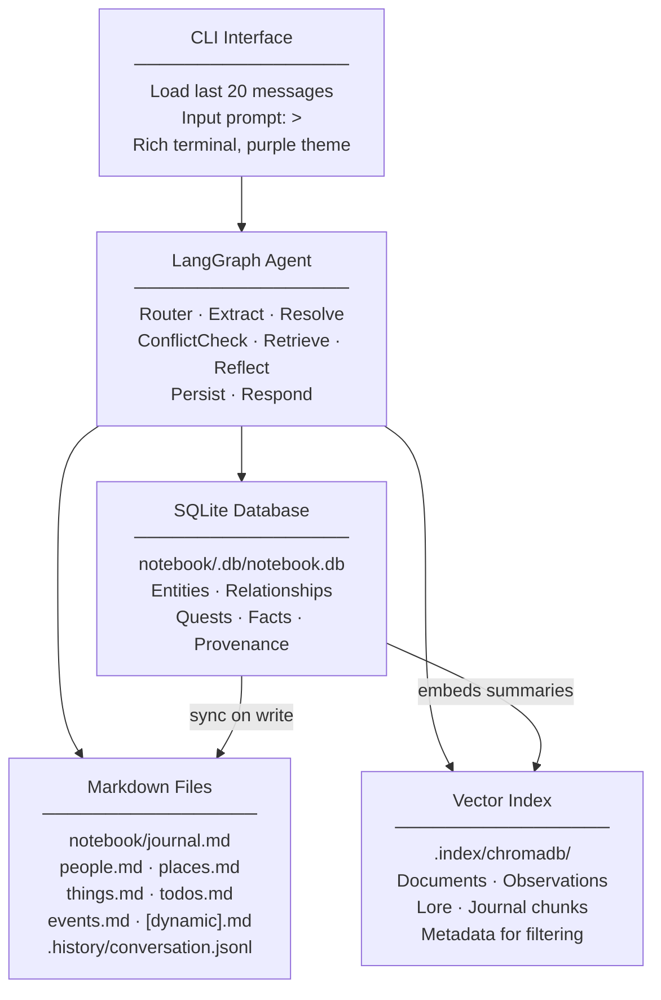
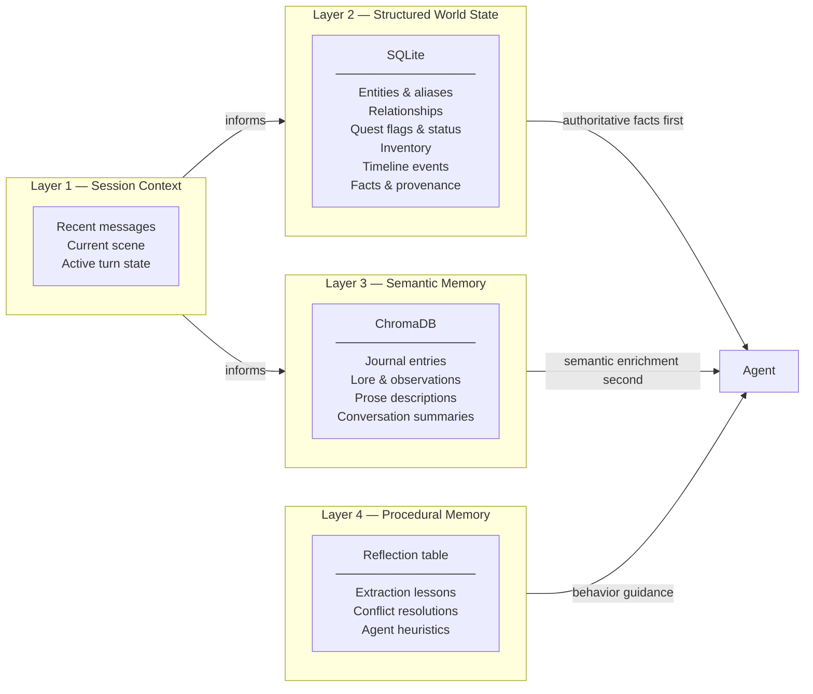
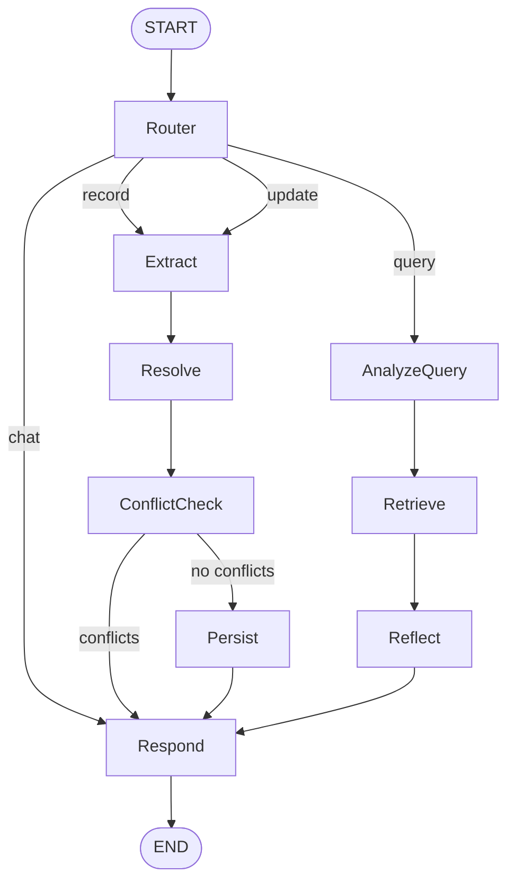
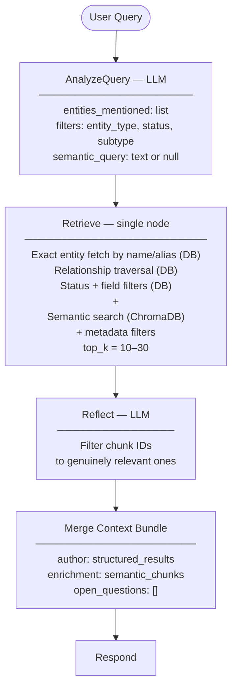

# Game Notebook — Design Document

A conversational agentic tool that acts as a smart notebook for 1st-person RPG games. It records observations, tracks entities, and helps recall information — like talking to someone with perfect memory.

## Overview

### Purpose
- Record observations as the player narrates their game
- Help recall people, places, items, quests, and mysteries
- Track open objectives and what's been completed
- Remember corrections and update knowledge accordingly

### Design Principles
- **Conversational**: Natural dialogue, no visible internal mechanics
- **Memory-first**: Records and recalls, doesn't advise or strategize
- **Persistent**: Knowledge survives across sessions
- **Organized**: Structured storage with semantic search capability
- **Authoritative**: Structured facts are ground truth; semantic recall is enrichment only

---

## Architecture



---

## Memory Architecture

The system uses four distinct memory layers, each with a clear role. Mixing these layers is the primary source of agent hallucination, so the boundary between them is enforced by design.



**The golden rule**: if a value must support equality tests, filters, joins, or state transitions — it belongs in the database. If it helps answer "what feels related?" — it belongs in the vector store.

| Memory type | Store | Why |
|-------------|-------|-----|
| Quest flags, status, inventory, NPC status, timestamps | SQLite | Exact lookup, constraints, updates, auditing |
| Entity relationships ("A serves B", "Place X contains Y") | SQLite relationships table | Explicit traversal; vectors miss directionality |
| Lore text, journals, notes, observations, transcripts | ChromaDB | Fuzzy similarity and thematic recall |
| Agent reflections, extraction lessons | SQLite reflection table + optional embeddings | Behavior guidance isolated from world facts |

---

## Storage

### File Structure

```
game_notebook/
├── src/                        # Agent code
├── notebook/                   # Game data
│   ├── journal.md              # Chronological observations (human-readable)
│   ├── people.md               # Characters (rendered from DB)
│   ├── places.md               # Locations (rendered from DB)
│   ├── things.md               # Items and equipment (rendered from DB)
│   ├── todos.md                # Quests, plans, mysteries (rendered from DB)
│   ├── events.md               # Events and hazards (rendered from DB)
│   ├── [dynamic].md            # New files as topics emerge
│   ├── .db/
│   │   └── notebook.db         # SQLite canonical store (gitignored)
│   ├── .index/                 # Vector store (gitignored)
│   │   ├── chromadb/           # ChromaDB persistent store
│   │   └── hashes.json         # Chunk content hashes
│   └── .history/
│       └── conversation.jsonl  # Conversation persistence
├── docs/
│   └── design.md
├── pyproject.toml
└── README.md
```

Markdown files remain the human-readable, git-friendly view of the world. They are rendered from the database on write, not the source of truth. The database is the source of truth.

### SQLite Schema

```sql
-- Canonical entities
CREATE TABLE entities (
    id          INTEGER PRIMARY KEY AUTOINCREMENT,
    name        TEXT NOT NULL,
    type        TEXT NOT NULL,  -- characters|locations|items|todos|events
    status      TEXT,
    created_at  TEXT NOT NULL,
    updated_at  TEXT NOT NULL,
    UNIQUE(name, type)
);

-- Name aliases for coreference ("the innkeeper", "Mara", "the woman at the tavern")
CREATE TABLE aliases (
    entity_id   INTEGER NOT NULL REFERENCES entities(id) ON DELETE CASCADE,
    alias       TEXT NOT NULL,
    PRIMARY KEY (entity_id, alias)
);

-- Typed field values (role, location, subtype, explored, etc.)
CREATE TABLE entity_fields (
    entity_id   INTEGER NOT NULL REFERENCES entities(id) ON DELETE CASCADE,
    field       TEXT NOT NULL,
    value       TEXT NOT NULL,
    PRIMARY KEY (entity_id, field)
);

-- Directed relationships between entities (to_name is the target entity name,
-- not a foreign key — allows relationships to entities not yet in DB)
CREATE TABLE relationships (
    from_id     INTEGER NOT NULL REFERENCES entities(id) ON DELETE CASCADE,
    to_name     TEXT NOT NULL,
    relation    TEXT NOT NULL,  -- "serves", "contains", "is at", "related to"
    asserted_at TEXT NOT NULL,
    PRIMARY KEY (from_id, to_name, relation)
);

-- Immutable fact log with provenance
CREATE TABLE facts (
    id          INTEGER PRIMARY KEY AUTOINCREMENT,
    entity_id   INTEGER NOT NULL REFERENCES entities(id) ON DELETE CASCADE,
    field       TEXT NOT NULL,
    old_value   TEXT,
    new_value   TEXT NOT NULL,
    source      TEXT NOT NULL DEFAULT 'player_observed',  -- "player_observed"|"narrator"|"inferred"|"speculative"
    confidence  TEXT NOT NULL DEFAULT 'certain',          -- "certain"|"likely"|"uncertain"
    asserted_at TEXT NOT NULL,
    turn_text   TEXT            -- raw user input that produced this fact
);

-- Timestamped history entries per entity (journal sub-log)
CREATE TABLE entity_history (
    id          INTEGER PRIMARY KEY AUTOINCREMENT,
    entity_id   INTEGER NOT NULL REFERENCES entities(id) ON DELETE CASCADE,
    note        TEXT NOT NULL,
    recorded_at TEXT NOT NULL
);

-- Agent reflection notes (isolated from world facts)
CREATE TABLE reflections (
    id          INTEGER PRIMARY KEY AUTOINCREMENT,
    category    TEXT NOT NULL,  -- "extraction"|"conflict"|"coreference"
    note        TEXT NOT NULL,
    created_at  TEXT NOT NULL
);
```

### Provenance Model

Every write to `entity_fields` produces a `facts` row. This enables:
- Conflict detection (new value differs from existing fact)
- Audit trail (what the player said that produced each fact)
- Confidence-weighted recall (certain facts take precedence over speculative ones)
- Temporal queries ("what was true at session 3?")

Sources:
- `player_observed` — the player directly saw or heard this
- `narrator` — established by the game system
- `inferred` — the agent deduced it from context
- `speculative` — uncertain, tagged with `(probable)` in output

### Markdown File Format

Markdown files are rendered from the database on every write. Format unchanged for human readability:

```yaml
---
type: <entity type>
description: <brief description>
---
```

Entity types: `observations`, `characters`, `locations`, `items`, `equipment`, `events`, `hazards`

### Entity Format

```markdown
## Entity Name
**Status:** active | open | resolved | completed | answered | unknown
**Location:** where it is (if applicable)
**Role:** what they do (for characters)
**Category:** item category (for items/events)
**Explored:** yes | partial | no (for locations)
**Position:** spatial relationship (for locations)
**Parent:** [[ContainingPlace]] (for locations)
**Subtype:** quest | plan | mystery (for todos)
**Outcome:** how/why it was resolved (for completed/answered todos)
**Date:** YYYY-MM-DD (for events)
**Related:** [[EntityName]], [[OtherEntity]]

- Bullet point details
- History appended chronologically

### YYYY-MM-DD
- Timestamped history entry (appended on updates)
```

### Journal Format

Chronological, append-only (never rendered from DB — the journal is always written directly):

```markdown
## Session — YYYY-MM-DD HH:MM
- Observation one
- Observation two
```

### Dynamic File Creation

The agent creates new markdown files when topics don't fit existing categories, auto-updating README.md:

| Situation | New File |
|-----------|----------|
| Multiple vehicles mentioned | `vehicles.md` |
| Faction politics emerge | `factions.md` |
| Crafting system details | `crafting.md` |

---

## LangGraph Agent

### State Schema

```python
class NotebookState(TypedDict, total=False):
    # Conversation
    messages: list[BaseMessage]           # Last N turns (trimmed to 40)
    user_input: str

    # Intent classification
    intent: Literal["record", "query", "update", "chat"] | None

    # Extraction phase
    extracted_observations: list[str]
    extracted_entities: list[dict]        # New people, places, items, quests
    extracted_updates: list[dict]         # Status/field changes to existing entities
    extracted_relationships: list[dict]   # Links between entities

    # Resolution phase
    resolved_entities: list[dict]         # After coreference disambiguation

    # Conflict detection
    conflicts: list[dict]                 # Facts that contradict current DB state

    # Retrieval phase
    query_filters: dict | None            # Structured metadata filters
    semantic_query: str | None            # Text for vector search
    structured_results: list[dict]        # Results from DB exact lookup
    retrieved_chunks: list[dict]          # Results from semantic search

    # Output
    response: str
    files_modified: list[str]
    error: str | None
```

Note: the `analyze_query` node also populates a private `_entities_mentioned` list (leading underscore) that carries named entities from the query for structured DB lookups in the `retrieve` node.

### Graph Structure



The `Retrieve` node performs both structured (DB) and semantic (ChromaDB) lookup in a single pass. The `ConflictCheck` node compares extracted facts against current DB state. On conflict, the agent responds with the discrepancy and asks the player to confirm before writing — preventing silent overwrites of canon facts.

### Intent Classification

| Intent | Trigger Examples |
|--------|------------------|
| `record` | "I found...", "Just discovered...", "Met someone..." |
| `query` | "What do I know about...", "Where is...", "What's open?" |
| `update` | "Mark X as done", "Actually, X is Y not Z", "I finished..." |
| `chat` | "Hello", "Thanks", "What can you do?" |

**Key rule**: A message mentioning a new person is always `record`, never `update`.

---

## Retrieval

### Hybrid Retrieval Strategy

Structured state is always queried first. Semantic recall is enrichment only.



The LLM prompt for `Respond` receives context in this order:
1. **Authoritative state** — DB rows, exact fields, relationship edges
2. **Semantic enrichment** — relevant journal passages, lore, observations
3. **Open questions** — unresolved conflicts or gaps

This ordering prevents semantic recall from overriding known canon facts.

### Query Examples

| Query | DB Lookup | Semantic Search |
|-------|-----------|-----------------|
| "What quests are open?" | `entity_type=todos, status=open` | None |
| "What did Kira say?" | Fetch Kira entity + relationships | "Kira said mentioned" |
| "Anything about curses?" | None | "curse cursed magical affliction" |
| "Open quests in Millhaven" | `entity_type=todos, status=open` | "Millhaven" |
| "What's Roger's role?" | `entity=Roger, field=role` | None |

Status filters only applied when **explicitly** requested ("open quests", "completed tasks").

### What Gets Embedded

Only these document types go into the vector store:

| Document type | Why embedded |
|---------------|-------------|
| Journal session entries | Narrative recall, thematic search |
| Entity prose descriptions | Lore and flavor text |
| Observations (extracted) | "What do I know about X?" fuzzy queries |
| Conversation summaries | Session continuity |
| Reflection notes | Agent behavior retrieval |

Entity fields, quest status, relationship edges, inventory — these are **not** embedded. They are queried exactly from the DB.

### Vector Index

**Chunking strategy:**
- Journal: split at `##` session headers
- Entities: one chunk per `##` section (full entity block, including field key-value pairs)
- Observations: one chunk per extracted observation string

**Chunk metadata:**
```python
{
    "doc_type": "journal|entity_prose|observation|reflection",
    "entity_name": "Roger",        # if linked to an entity
    "entity_type": "characters",   # if linked to an entity
    "session_date": "2024-01-15",  # for journal chunks
    "source": "player_observed",   # provenance
    "status": "open",              # for todo/quest chunks (enables metadata filters)
    "subtype": "quest",            # for todo chunks
}
```

**Chunk IDs** follow the pattern `<filename>::<entity_name>` (e.g. `people.md::Roger`). This allows targeted upsert and deletion without a full re-index.

### Reflection (Relevance Filtering)

After semantic search, a lightweight LLM pass filters chunks to only those genuinely relevant to the query. This prevents metadata keyword collisions from polluting results.

The reflect node builds a compact list of `{id, summary}` pairs and asks the LLM to return only the relevant IDs. On JSON parse failure it passes all chunks through unchanged.

### Incremental Index Updates

Index updates happen after every Persist via content-hash tracking:

| Action | DB Operation | Index Operation |
|--------|-------------|-----------------|
| New entity | INSERT entities row | Embed entity section chunk |
| New observation | INSERT fact | Embed observation chunk |
| Journal append | Append to journal.md | Upsert session chunk |
| Entity field updated | UPDATE entity_fields | Re-embed changed chunk (hash changed) |
| Unchanged entity | — | Skip (hash unchanged) |
| Full `/rebuild` | — | Clear hashes, re-index all prose/journal |

Hash tracking uses `<filename>::<entity_name>` as the key. If the hash differs from the stored value, the chunk is re-embedded; if not, it is skipped. This makes repeated `index_file` calls idempotent on unchanged content.

---

## Entity Extraction

### Extraction Output

```json
{
  "observations": ["string", ...],
  "entities": [
    {
      "name": "Kira",
      "type": "character",
      "is_new": true,
      "source": "player_observed",
      "confidence": "certain",
      "fields": {"role": "blacksmith", "location": "Millhaven"}
    }
  ],
  "updates": [
    {"entity": "Roger", "field": "role", "old_value": "loadmaster", "new_value": "captain", "source": "player_observed", "confidence": "certain"},
    {"entity": "Recover Key Quest", "field": "status", "old_value": "open", "new_value": "completed", "source": "player_observed", "confidence": "certain"},
    {"entity": "Recover Key Quest", "field": "outcome", "old_value": "", "new_value": "Found at Sorrell's fishing hab", "source": "player_observed", "confidence": "certain"}
  ],
  "relationships": [
    {"from": "Kira", "relation": "is at", "to": "Millhaven", "source": "player_observed", "confidence": "certain"}
  ]
}
```

Every extracted item carries `source` and `confidence`. These propagate to the `facts` table for provenance tracking.

**Field types by entity type:**
- Character: `role`, `location`, `status`, `description`
- Location: `explored`, `position`, `parent`, `status`, `description`
- Item: `category`, `status`, `location`, `description`
- Todo: `subtype` (quest/plan/mystery), `status`, `requires`, `outcome`, `description`
- Event: `category`, `date`, `location`, `status`, `description`

**Critical rule**: New people/places MUST appear as entities with `is_new: true`. Uncertain info is tagged with `(probable)` and written with `confidence: "uncertain"`.

### Coreference Resolution

After extraction, each entity name is resolved against DB aliases before any write. The extractor receives `known_entities` (a dict of type → name list) from `NotebookDB.get_known_entities()` so it can identify potentially ambiguous references.

```
For each extracted entity:
  if is_new is False → already resolved by LLM, use name as-is
  if name matches known entity → run coreference LLM to confirm match
    if certain/likely → is_new=False, resolved to canonical entity
    else → treat as new entity, note ambiguity in reflection table
  if name not in known entities AND is_new=true → genuinely new, INSERT
```

Coreference output:
```json
{
  "resolved_to": "EntityName",
  "confidence": "certain | likely | uncertain",
  "reasoning": "brief explanation"
}
```

The alias table is updated on every confirmed coreference match, so "the innkeeper" resolving to "Mara" is remembered for next time.

### Conflict Detection

Before any write, the `ConflictCheck` node compares proposed updates against current DB state:

```python
for update in extracted_updates:
    current = db.get_field(update["entity"], update["field"])
    if current is None:
        continue  # Field doesn't exist yet — no conflict

    # Only flag a conflict when the player explicitly stated a prior value
    # that doesn't match what's in the DB. An empty old_value means the
    # extractor didn't assert a prior state — that's a normal update.
    # Also skip if new_value matches current (re-stating the same fact).
    if (
        old_value
        and current.lower() != new_value.lower()
        and current.lower() != old_value.lower()
    ):
        conflicts.append({...})
```

On conflict, the agent responds describing the discrepancy and asks the player to confirm. A confirmed override writes to the DB and records both values in the `facts` log with the player's confirmation noted in `turn_text`.

---

## Persist Node

The `persist` node handles all writes for both `record` and `update` intents:

1. **Observations** — embed as observation chunk; journal append (record only)
2. **Journal** (record only) — append observations as a new `## Session —` entry, upsert journal chunk in vector index
3. **New entities** — INSERT into `entities`, `entity_fields`, `aliases`; render markdown section; re-index file
4. **Field updates** — UPDATE `entity_fields`, INSERT `facts` provenance row, re-render markdown section, re-index file
5. **Completion propagation** — when a todo's `status` becomes `completed` or `answered`:
   - Query `related` names on the todo entity
   - Find related items in `entities` with unacquired status (lost / not obtained / not recovered / unknown)
   - UPDATE those items' status to `found` in DB and markdown
   - Write fallback `Outcome` from raw user input if extractor didn't produce one (both to DB and markdown)
6. **Relationships** — INSERT into `relationships` table; append `Related to [[Entity]]` to markdown
7. **Re-index** — call `index.index_file` for each modified file

---

## Respond Node — Contextual Enrichment

For `record` and `update` intents, the respond node enriches the reply using the two-layer context bundle.

**Steps:**
1. Collect entity names from resolved entities and extracted updates
2. Fetch those entities from DB (exact fields, status, relationships)
3. Run semantic search over journal/observations for each entity name (top 3, deduped)
4. Run additional semantic search filtered to `entity_type=todos, status=open` — surfaces unblocked next steps
5. Inject into LLM prompt: authoritative DB rows first, semantic chunks second

The LLM is instructed to treat DB rows as ground truth and semantic chunks as supporting context only.

For `query` intent: semantic results are deduplicated against DB results — chunks whose entity name already appears in structured results are treated as enrichment only, not repeated.

---

## CLI Interface

### Startup Sequence

1. Load `.env` configuration
2. Validate notebook path
3. Initialize `NotebookDB` (SQLite), `MarkdownStore`, `NotebookIndex`
4. Full reindex on startup (removes orphaned chunks)
5. Restore last 20 messages from `conversation.jsonl`
6. Display banner, stats, history

```
╭─────────────────────────────────────────╮
│          Miner's Notebook               │
│   A memory for your mining adventures   │
╰─────────────────────────────────────────╯

Loaded 847 chunks · 142 entities · 8 files. 20 messages restored.

[Previous conversation displayed in dim text]

> _
```

### Commands

| Command | Action |
|---------|--------|
| `/quit`, `/exit`, `/q` | Exit the notebook |
| `/status` | Show chunk/entity/file/message stats |
| `/reindex` | Incremental re-index (changed chunks only) |
| `/rebuild` | Full index rebuild from scratch |
| `/clear` | Clear conversation history (keeps knowledge base) |
| `/conflicts` | Show any pending unresolved conflicts |
| `/help` | Show command list |

### Conversation Persistence

Stored in `notebook/.history/conversation.jsonl`:

```jsonl
{"role": "user", "content": "I found the key", "ts": "2024-01-15T10:23:00"}
{"role": "assistant", "content": "Got it...", "ts": "2024-01-15T10:23:01"}
```

- Last 40 messages kept in memory per session
- Last 20 messages displayed on startup
- Agent responses rendered in purple using Rich Markdown

---

## Response Style

### System Prompt Behavior

- Memory-only: records and recalls, never advises or strategizes
- Concise and conversational, second person ("you found", "you've got")
- Record: brief acknowledgement, confirm key facts, mention related open items or next steps
- Query: answer directly from authoritative DB state; mention supporting context from journal if relevant
- Update: acknowledge the change, mention what is now unblocked
- Never expose internal mechanics, mention files, or reveal whether a fact came from DB vs vector store

### Response Examples

**Recording:**
```
> met a mechanic named Yuki at the surface base, she fixes drones
Added Yuki — mechanic at the surface base, works on drones.
```

**Querying:**
```
> what do I know about Rupert?
Rupert Sanford is the custodian. He's been complaining to Kingston
about missing cleaning supplies — you haven't resolved that yet.
```

**Correcting:**
```
> actually Roger is the captain, not loadmaster
Noted. Updated Roger's role from loadmaster to captain.
```

**Completing a quest:**
```
> I recovered the Loadmaster's Key at Sorrell's fishing hab
You recovered the Loadmaster's Key. That completes Recover Loadmaster's Key.
The next open step is Unlock Epsilon Secure Storage, which is now unblocked.
```

**Conflict detected:**
```
> Roger is the loadmaster
Roger's role is currently recorded as captain (updated last session). Did
you mean to change it back, or is this a different Roger?
```

---

## Implementation Notes

### Technology Stack

| Layer | Technology | Purpose |
|-------|-----------|---------|
| Agent | LangGraph | Graph-based orchestration |
| LLM | OpenAI or Anthropic (configurable) | Intent, extraction, responses |
| Canonical store | SQLite (`sqlite3` stdlib) | Entities, facts, relationships, provenance |
| Embeddings | sentence-transformers (local) or OpenAI | Vector search |
| Vector DB | ChromaDB | Semantic recall over prose and journal |
| Markdown | Rendered from DB on write | Human-readable, git-friendly view |
| UI | Rich | Terminal rendering with colors/markdown |
| Config | dotenv | Environment-based configuration |

### Source Layout

```
src/
├── agent/
│   ├── graph.py        # LangGraph definition + NotebookAgent wrapper
│   ├── nodes.py        # All node implementations + NodeFactory
│   └── state.py        # NotebookState TypedDict schema
├── storage/
│   ├── db.py           # NotebookDB: SQLite reads/writes, schema migration
│   ├── markdown.py     # MarkdownStore: render markdown from DB; journal appends
│   ├── index.py        # NotebookIndex: ChromaDB + hybrid search
│   └── migrate.py      # One-time migration: parse markdown → SQLite
├── extraction/
│   └── entities.py     # EntityExtractor: LLM extraction + coreference
├── cli/
│   └── interface.py    # NotebookCLI: Rich terminal UI + input loop
└── main.py             # Entry point: LLM factory + startup orchestration
```

### Configuration

Environment variables (`.env`):

| Variable | Default | Description |
|----------|---------|-------------|
| `LLM_PROVIDER` | `openai` | `openai` or `anthropic` |
| `OPENAI_MODEL` | `gpt-4o` | OpenAI model name |
| `ANTHROPIC_MODEL` | `claude-sonnet-4-6` | Anthropic model name |
| `EMBEDDING_PROVIDER` | `local` | `local` or `openai` |
| `NOTEBOOK_PATH` | `./notebook` | Game data directory |

### Recording Rules
- Preserve first-person tone in journal entries
- Cross-reference entities using `[[wiki-links]]`
- Tag uncertain info as `(probable)` until confirmed in-world; write with `confidence: "uncertain"` in DB
- History is chronological (oldest first, newest at bottom)
- Corrections update the canonical DB field; original value preserved in `facts` log
- Reflections are stored in the `reflections` table, never mixed with world facts

### DB Seeding

The SQLite DB is not populated from the markdown on first run automatically. The `migrate` module (`src/storage/migrate.py`) parses all markdown files and seeds the DB. This must be run before first use if the notebook was previously markdown-only. E2E test fixtures must call `migrate()` after seeding markdown to ensure `get_known_entities()` returns accurate data for the extraction prompt.
