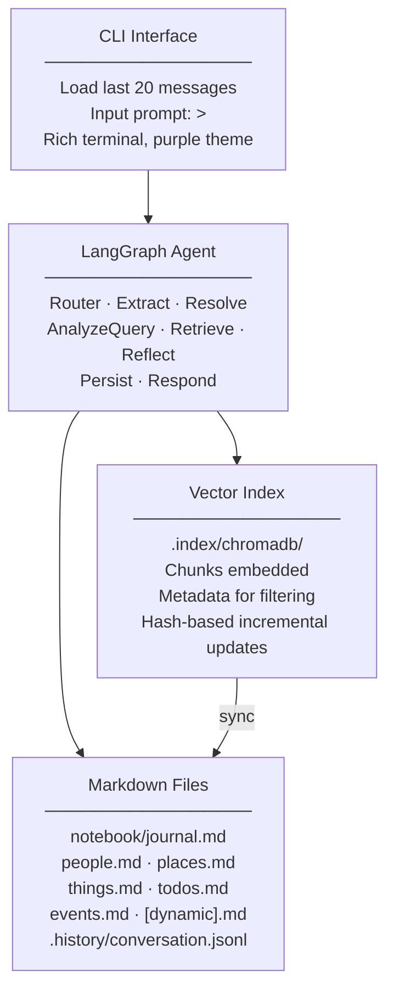
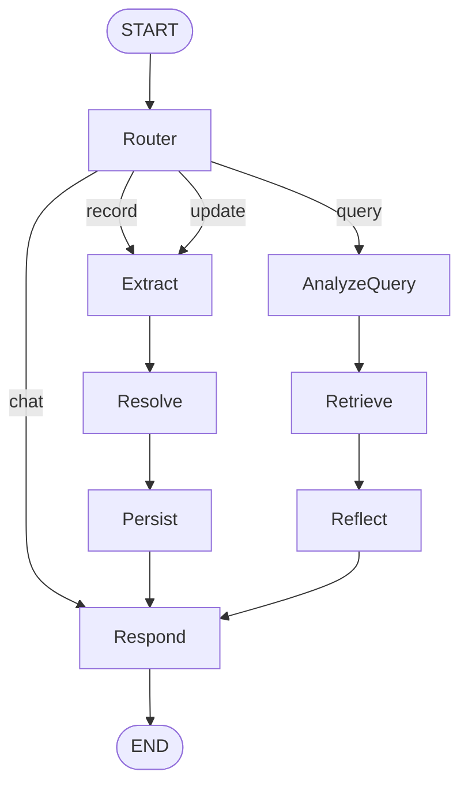
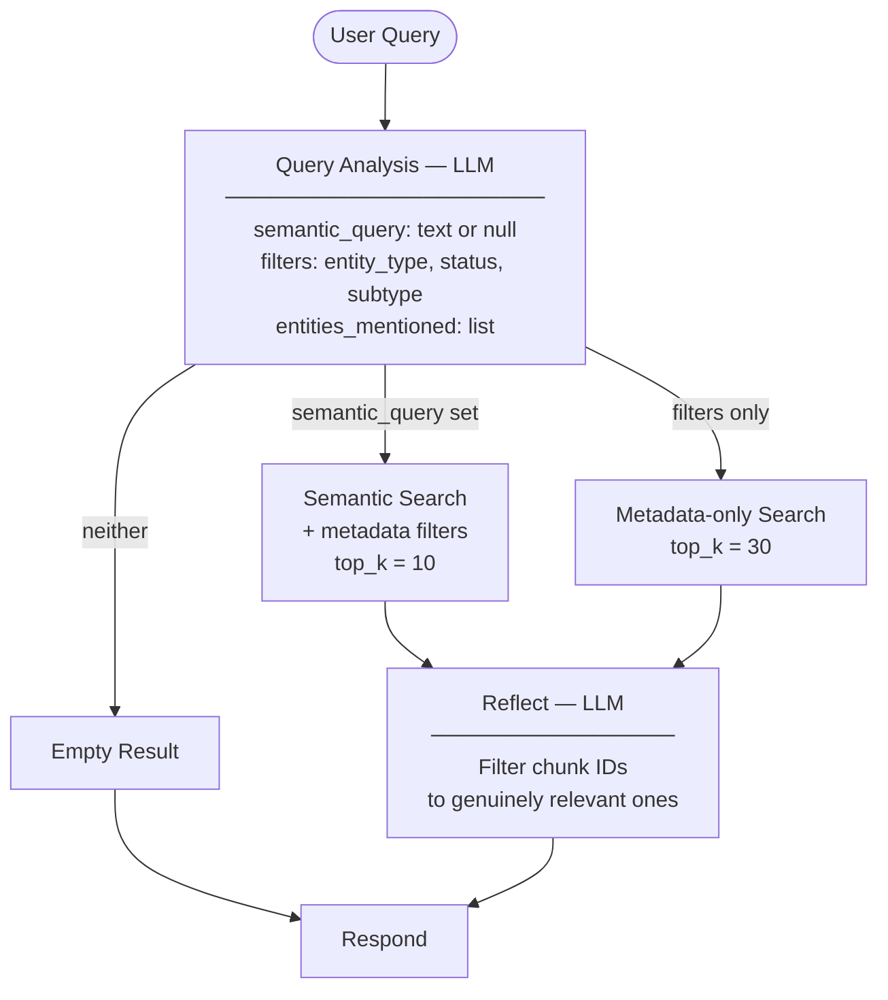

# Game Notebook — Design Document

A conversational agentic tool that acts as a smart notebook for 1st-person RPG games. It records observations, tracks entities, and helps recall information — like talking to someone with perfect memory.

## Overview

### Purpose
- Record observations as the player narrates their game
- Help recall people, places, items, quests, and mysteries
- Track open objectives and what's been completed
- Remember corrections and update knowledge accordingly

### Design Principles
- **Conversational**: Natural dialogue, no visible internal mechanics
- **Memory-first**: Records and recalls, doesn't advise or strategize
- **Persistent**: Knowledge survives across sessions
- **Organized**: Structured storage with semantic search capability

---

## Architecture



---

## Storage

### File Structure

```
game_notebook/
├── src/                        # Agent code
├── notebook/                   # Game data
│   ├── journal.md              # Chronological observations
│   ├── people.md               # Characters
│   ├── places.md               # Locations
│   ├── things.md               # Items and equipment
│   ├── todos.md                # Quests, plans, mysteries
│   ├── events.md               # Events and hazards
│   ├── [dynamic].md            # New files as topics emerge
│   ├── .index/                 # Vector store (gitignored)
│   │   ├── chromadb/           # ChromaDB persistent store
│   │   └── hashes.json         # Chunk content hashes
│   └── .history/
│       └── conversation.jsonl  # Conversation persistence
├── docs/
│   └── design.md
├── pyproject.toml
└── README.md
```

### Markdown File Format

Each file has YAML frontmatter:

```yaml
---
type: <entity type>
description: <brief description>
---
```

Entity types: `observations`, `characters`, `locations`, `items`, `equipment`, `events`, `hazards`

Todos file uses a single type `todos` with **Subtype** field to distinguish: `quest | plan | mystery`

### Entity Format

```markdown
## Entity Name
**Status:** active | open | resolved | completed | answered | unknown
**Location:** where it is (if applicable)
**Role:** what they do (for characters)
**Category:** item category (for items/events)
**Explored:** yes | partial | no (for locations)
**Position:** spatial relationship (for locations)
**Parent:** [[ContainingPlace]] (for locations)
**Subtype:** quest | plan | mystery (for todos)
**Outcome:** how/why it was resolved (for completed/answered todos)
**Date:** YYYY-MM-DD (for events)
**Related:** [[EntityName]], [[OtherEntity]]

- Bullet point details
- History appended chronologically

### YYYY-MM-DD
- Timestamped history entry (appended on updates)
```

The `**Outcome:**` field is written automatically when a todo's status becomes `completed` or `answered`. The extractor produces it from the user's message; if the message contains no detail (e.g. a bare "mark as done"), the raw user input is used as a fallback.

### Journal Format

Chronological, append-only:

```markdown
## Session — YYYY-MM-DD HH:MM
- Observation one
- Observation two
```

Newest entries at the bottom.

### Dynamic File Creation

The agent creates new markdown files when topics don't fit existing categories, auto-updating README.md:

| Situation | New File |
|-----------|----------|
| Multiple vehicles mentioned | `vehicles.md` |
| Faction politics emerge | `factions.md` |
| Crafting system details | `crafting.md` |

---

## LangGraph Agent

### State Schema

```python
class NotebookState(TypedDict):
    # Conversation
    messages: list[BaseMessage]           # Last N turns (trimmed to 40)
    user_input: str

    # Intent classification
    intent: Literal["record", "query", "update", "chat"] | None

    # Extraction phase
    extracted_observations: list[str]
    extracted_entities: list[dict]        # New people, places, items, quests
    extracted_updates: list[dict]         # Status/field changes to existing entities
    extracted_relationships: list[dict]   # Links between entities

    # Resolution phase
    resolved_entities: list[dict]         # After coreference disambiguation

    # Retrieval phase
    query_filters: dict | None            # Structured metadata filters
    semantic_query: str | None            # Text for vector search
    retrieved_chunks: list[dict]          # Results from hybrid search

    # Output
    response: str
    files_modified: list[str]
    error: str | None
```

### Graph Structure



Both `record` and `update` intents share the same path: Extract → Resolve → Persist. The `persist` node uses `intent` to decide whether to append to the journal (record only).

### Intent Classification

| Intent | Trigger Examples |
|--------|------------------|
| `record` | "I found...", "Just discovered...", "Met someone..." |
| `query` | "What do I know about...", "Where is...", "What's open?" |
| `update` | "Mark X as done", "Actually, X is Y not Z", "I finished..." |
| `chat` | "Hello", "Thanks", "What can you do?" |

**Key rule**: A message mentioning a new person is always `record`, never `update`.

---

## Retrieval

### Hybrid Search Strategy



### Reflection (Relevance Filtering)

After hybrid search, a lightweight LLM pass filters the retrieved chunks to only those genuinely relevant to the query. This prevents metadata keyword collisions from polluting results (e.g. a query about "codes" returning mining rigs because they share a keyword).

The reflect node builds a compact list of `{id, summary}` pairs and asks the LLM to return only the relevant IDs. On JSON parse failure it passes all chunks through unchanged.

### Query Examples

| Query | Filters | Semantic Search |
|-------|---------|-----------------|
| "What quests are open?" | `entity_type=todos, status=open` | None |
| "What did Kira say?" | None | "Kira said mentioned" |
| "Anything about curses?" | None | "curse cursed magical affliction" |
| "Open quests in Millhaven" | `entity_type=todos, status=open` | "Millhaven" |

Status filters are only applied when **explicitly** requested ("open quests", "completed tasks").

### Vector Index

**Chunking strategy:**
- Split each file at `##` headers
- Each chunk = one entity or one journal session

**Chunk metadata:**
```python
{
    "file": "people.md",
    "entity_type": "characters",
    "entity_name": "Roger",
    "status": "unknown",
    "location": "",
    "related": "Sorrell,Jack",   # comma-separated
}
```

**Embedding model options:**
- Local (default): `sentence-transformers/all-MiniLM-L6-v2`
- API: OpenAI `text-embedding-3-small`

### Incremental Index Updates

Index updates happen after every Persist via content-hash tracking:

| Action | Index Operation |
|--------|-----------------|
| New observation in journal | Upsert session chunk |
| New entity created | Insert new chunk |
| Entity field updated | Upsert entity chunk |
| Entity history appended | Upsert entity chunk |
| Full `/rebuild` command | Clear hashes, re-index all |

Orphaned chunks (from deletions/renames) are removed during startup full reindex.

---

## Entity Extraction

### Extraction Output

```json
{
  "observations": ["string", ...],
  "entities": [
    {
      "name": "Kira",
      "type": "character",
      "is_new": true,
      "fields": {"role": "blacksmith", "location": "Millhaven"}
    }
  ],
  "updates": [
    {"entity": "Roger", "field": "role", "old_value": "loadmaster", "new_value": "captain"},
    {"entity": "Recover Key Quest", "field": "status", "old_value": "open", "new_value": "completed"},
    {"entity": "Recover Key Quest", "field": "outcome", "old_value": "", "new_value": "Found at Sorrell's fishing hab"}
  ],
  "relationships": [
    {"from": "Kira", "relation": "is at", "to": "Millhaven"}
  ]
}
```

**Field types by entity type:**
- Character: `role`, `location`, `status`
- Location: `explored`, `position`, `parent`
- Item: `category`, `status`, `location`
- Todo: `subtype` (quest/plan/mystery), `status`, `requires`, `outcome`
- Event: `category`, `date`, `location`, `status`

**Critical rule**: New people/places MUST appear as entities with `is_new: true`. Uncertain info is tagged with `(probable)`.

When a todo's status is set to `completed` or `answered`, the extractor also emits a companion `outcome` update summarising how/why it was resolved.

### Coreference Resolution

After extraction, each entity is resolved against known entities:

```
For each extracted entity:
  if is_new=true AND name NOT in known_entities → genuinely new, skip LLM call
  if is_new=true AND name IS in known_entities → run coreference LLM
    if confident match (certain/likely) → is_new=False, resolved_name = matched name
    else → treat as new entity
  if is_new=false → already resolved
```

Coreference output:
```json
{
  "resolved_to": "EntityName",
  "confidence": "certain | likely | uncertain",
  "reasoning": "brief explanation"
}
```

---

## Persist Node

The `persist` node handles all writes for both `record` and `update` intents:

1. **Journal** (record only) — appends observations as a new `## Session —` entry
2. **New entities** — calls `create_entity` for each `is_new=true` entity
3. **Field updates** — calls `update_entity` for each extracted update
   - If the field already exists in the section, the value is replaced in-place
   - If the field does not exist, it is inserted after the last `**Field:**` line
4. **Completion propagation** — when a todo's `Status` becomes `completed` or `answered`:
   - Reads the todo's `Related` links
   - Finds any linked items in `things.md` whose status indicates unacquired (`lost`, `not obtained`, `not recovered`, `unknown`)
   - Updates those items' `Status` to `found`
   - Writes a fallback `Outcome` from the raw user input if the extractor didn't produce one
5. **Relationships** — appends `Related to [[Entity]]` history entries
6. **Re-index** — calls `index_file` on every modified file

---

## Respond Node — Contextual Enrichment

For `record` and `update` intents, the respond node enriches the reply with related context from the index rather than just echoing back what was recorded.

**Steps:**
1. Collect search queries from entity names, update entity names, and observation strings
2. Run `hybrid_search` for each query (top 3, deduped by chunk ID)
3. Run an additional `hybrid_search` filtered to `entity_type=todos, status=open` using the combined query text — surfaces unblocked next steps
4. Inject all retrieved chunks into the LLM prompt

This means after recording Simone Parker's death the response can mention her known location, and after recovering a key the response can mention the quest that is now unblocked.

---

## CLI Interface

### Startup Sequence

1. Load `.env` configuration
2. Validate notebook path
3. Initialize MarkdownStore and NotebookIndex
4. Full reindex on startup (removes orphaned chunks)
5. Restore last 20 messages from `conversation.jsonl`
6. Display banner, stats, history
7. Enter input loop

```
╭─────────────────────────────────────────╮
│          Miner's Notebook               │
│   A memory for your mining adventures   │
╰─────────────────────────────────────────╯

Loaded 847 chunks from 8 files. 20 messages restored.

[Previous conversation displayed in dim text]

> _
```

### Commands

| Command | Action |
|---------|--------|
| `/quit`, `/exit`, `/q` | Exit the notebook |
| `/status` | Show chunk/file/message stats |
| `/reindex` | Incremental re-index (changed chunks only) |
| `/rebuild` | Full index rebuild from scratch |
| `/clear` | Clear conversation history (keeps knowledge base) |
| `/help` | Show command list |

### Conversation Persistence

Stored in `notebook/.history/conversation.jsonl`:

```jsonl
{"role": "user", "content": "I found the key", "ts": "2024-01-15T10:23:00"}
{"role": "assistant", "content": "Got it...", "ts": "2024-01-15T10:23:01"}
```

- Last 40 messages kept in memory per session
- Last 20 messages displayed on startup
- Agent responses rendered in purple using Rich Markdown

---

## Response Style

### System Prompt Behavior

- Memory-only: records and recalls, never advises or strategizes
- Concise and conversational, second person ("you found", "you've got")
- Record: brief acknowledgement, confirm key facts, mention related open items or next steps
- Query: answer directly, mention related open items if relevant
- Update: acknowledge the change, mention what is now unblocked
- Never expose internal mechanics or mention files

### Response Examples

**Recording:**
```
> met a mechanic named Yuki at the surface base, she fixes drones
Added Yuki — mechanic at the surface base, works on drones.
```

**Querying:**
```
> what do I know about Rupert?
Rupert Sanford is the custodian. He's been complaining to Kingston
about missing cleaning supplies — you haven't resolved that yet.
```

**Correcting:**
```
> actually Roger is the captain, not loadmaster
Noted. Updated Roger's role from loadmaster to captain.
```

**Completing a quest:**
```
> I recovered the Loadmaster's Key at Sorrell's fishing hab
You recovered the Loadmaster's Key. That completes Recover Loadmaster's Key.
The next open step is Unlock Epsilon Secure Storage, which is now unblocked.
```

---

## Implementation Notes

### Technology Stack

| Layer | Technology | Purpose |
|-------|-----------|---------|
| Agent | LangGraph | Graph-based orchestration |
| LLM | OpenAI or Anthropic (configurable) | Intent, extraction, responses |
| Embeddings | sentence-transformers (local) or OpenAI | Vector search |
| Vector DB | ChromaDB | Persistent semantic search |
| Storage | Markdown + YAML frontmatter | Human-readable, git-friendly |
| UI | Rich | Terminal rendering with colors/markdown |
| Config | dotenv | Environment-based configuration |

### Source Layout

```
src/
├── agent/
│   ├── graph.py        # LangGraph definition + NotebookAgent wrapper
│   ├── nodes.py        # All node implementations + NodeFactory
│   └── state.py        # NotebookState TypedDict schema
├── storage/
│   ├── markdown.py     # MarkdownStore: read/write/parse markdown files
│   └── index.py        # NotebookIndex: ChromaDB + hybrid search
├── extraction/
│   └── entities.py     # EntityExtractor: LLM extraction + coreference
├── cli/
│   └── interface.py    # NotebookCLI: Rich terminal UI + input loop
└── main.py             # Entry point: LLM factory + startup orchestration
```

### Configuration

Environment variables (`.env`):

| Variable | Default | Description |
|----------|---------|-------------|
| `LLM_PROVIDER` | `openai` | `openai` or `anthropic` |
| `OPENAI_MODEL` | `gpt-4o` | OpenAI model name |
| `ANTHROPIC_MODEL` | `claude-sonnet-4-20250514` | Anthropic model name |
| `EMBEDDING_PROVIDER` | `local` | `local` or `openai` |
| `NOTEBOOK_PATH` | `./notebook` | Game data directory |

### Recording Rules
- Preserve first-person tone in journal entries
- Cross-reference entities using `[[wiki-links]]`
- Tag uncertain info as `(probable)` until confirmed in-world
- History is chronological (oldest first, newest at bottom)
- Corrections update the canonical entry; original value preserved in timestamped history
