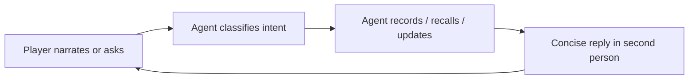
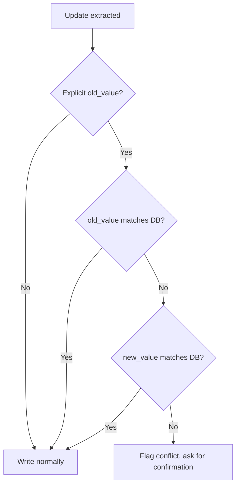

# Game Notebook — Functional Specification

A conversational CLI companion that remembers your 1st-person adventure game sessions. You talk to it like a notebook with perfect recall; it records what happened, recalls what you've seen, and tracks what's still open.

---

## 1. Purpose

Playing a long, lore-heavy adventure game produces more information than a player can hold in their head: NPCs met, places explored, items found, quests opened, mysteries unsolved, codes overheard. Game Notebook solves that problem by being a single persistent memory that:

- **Records** what you narrate during play
- **Recalls** people, places, items, todos, and events on request
- **Tracks** which objectives are open, blocked, or complete
- **Corrects** itself when you tell it something has changed
- **Detects conflicts** when what you say contradicts what it already knows

It does this in natural language. There are no menus, forms, or syntax to learn.

---

## 2. User Interaction Model

The player runs the CLI and gets a prompt. Each turn is a free-form line of text. The agent decides what kind of input it is and responds accordingly.



- Tone: second person ("you found", "you've got")
- Length: brief — typically one to three sentences
- The agent never explains how it works internally and never mentions files, databases, or chunks
- The last 20 messages from your previous session are displayed dimmed on startup so you have context

---

## 3. The Four Intents

Every player turn is classified into exactly one intent.

| Intent  | What it means                                     | Example                                                |
|---------|---------------------------------------------------|--------------------------------------------------------|
| record  | You are sharing new information                   | "Met a mechanic named Yuki at the surface base."       |
| query   | You are asking about something                    | "What do I know about Rupert?"                         |
| update  | You are correcting or completing something        | "Actually Roger is the captain, not loadmaster."       |
| chat    | Greeting, small talk, meta question               | "Hello", "Thanks", "What can you do?"                  |

### Special routing rule

A statement of a blocker or constraint is **always** treated as a `record`, never as `chat`. These all create or update a todo:

- "I can't get into Epsilon Storage."
- "I need a tech-component to repair the lift."
- "Opening the vault requires the loadmaster's key."

This guarantees impediments get captured rather than discarded as conversation.

---

## 4. What Gets Recorded

The notebook organizes the world into five entity types. Each has its own set of fields.

| Entity type | Purpose                                | Fields                                                                |
|-------------|----------------------------------------|-----------------------------------------------------------------------|
| character   | NPCs, factions, named people           | role, location, status, description                                   |
| location    | Places (regions, rooms, habs, areas)   | explored (`yes` / `partial` / `no`), status, position, parent, description |
| item        | Resources, equipment, key items, codes | category (`resource` / `equipment` / `key-item` / `tech-component` / `access-code`), status, location, description |
| todo        | Quests, plans, mysteries               | subtype (`quest` / `plan` / `mystery`), status (`open` / `in-progress` / `blocked` / `completed` / `answered`), requires, outcome |
| event       | Things that happened                   | category (`death` / `discovery` / `encounter` / `hazard-confirmed` / `quest-resolution` / `other`), date, location, status |

Alongside entities, every recorded turn also produces:

- **Observations** — short, plain-English sentences appended to a chronological journal
- **Relationships** — directed links like "Kira is at Millhaven", "Roger serves Captain Vance"

### Recording rules

- A new person, place, or item is always captured the first time it is mentioned. The notebook never silently drops new entities.
- Even when an item is mentioned only as a prerequisite ("I need a keycard to open the vault"), the keycard is recorded.
- Uncertain information is preserved with low confidence rather than discarded.

---

## 5. Query Capabilities

You can ask about the world in plain English. The notebook combines structured lookup (exact fields, status filters) with semantic recall (fuzzy thematic search through your journal).

| What you ask                          | How the notebook answers                                                         |
|---------------------------------------|----------------------------------------------------------------------------------|
| "What quests are open?"               | Filter todos by `status=open`                                                    |
| "What did Kira say?"                  | Fetch Kira's record, plus journal passages mentioning her                        |
| "Anything about curses?"              | Semantic search across journal and prose for the theme                           |
| "What's Roger's role?"                | Exact field lookup on Roger                                                      |
| "Open quests in Millhaven"            | Filter todos by `status=open`, semantic narrow by location                       |
| "What access codes do I have?"        | Filter items by `entity_type=items` (codes are stored as items)                  |
| "Where is the Loadmaster's Key?"      | Fetch item by name, surface its `location` field                                 |
| "What do I know about Sorrell's hab?" | Fetch location entity, plus related items, characters, and journal mentions      |

### Important behaviors

- **Status filters only apply when you explicitly ask for them.** "What quests are open?" filters by `status=open`; "What quests are there?" returns all of them.
- Access codes, passwords, and combinations are stored as items.
- Answers always combine structured facts (treated as ground truth) with relevant journal passages (treated as supporting context).

---

## 6. Updates and Corrections

You can change anything by saying so:

- **Field changes**: "Actually Roger is the captain, not loadmaster."
- **Status changes**: "Mark Recover Loadmaster's Key as done."
- **Completion narration**: "I recovered the Loadmaster's Key at Sorrell's fishing hab."

On an update, the notebook:

1. Updates the canonical field
2. Records the change in the fact history (the previous value is preserved)
3. Acknowledges the change in its reply
4. Mentions anything newly unblocked as a consequence

---

## 7. Conflict Detection

If you state a prior value that contradicts what the notebook already has, it stops and asks before overwriting.

A conflict is only raised when you **explicitly assert a prior value** that is wrong. Simply re-stating a current value, or asserting something new about an unfilled field, is just a normal update.



### Example

```
> Roger is the loadmaster
Roger's role is currently recorded as captain. Did you mean to change it
back, or is this a different Roger?
```

The write is held until you confirm.

---

## 8. Clarifying Questions

When you record something new, the notebook may ask **one** short question at the end of its reply — but only if a *consequential* fact is missing. Examples of consequential gaps:

- A character is tied to a quest and their allegiance is unknown
- An item is mentioned but its category (key-item vs equipment vs access-code) cannot be inferred

Cosmetic details (hair colour, mood) are never asked about. If the entity already has enough context, no question is asked.

When the notebook does ask, your reply on the next turn is treated as a normal record — there is no special "answering a question" mode.

### Example

```
> met a guard named Vex at the checkpoint
Added Vex — guard at the checkpoint. Which faction is she with?

> she works for the Syndicate
Got it — Vex serves the Syndicate.
```

---

## 9. Dependency Chains

When you describe a prerequisite chain, every entity in the chain is recorded and the dependency is captured.

> "I can't open the vault — I need the loadmaster's key, which is somewhere in Sorrell's fishing hab."

From that one sentence the notebook records:

- **Todo**: "Open the vault" — `status: blocked`, `requires: loadmaster's key`
- **Item**: "Loadmaster's key" — `category: key-item`, `status: unknown`, `location: Sorrell's fishing hab`
- **Location**: "Sorrell's fishing hab" — if not already known

Later, when you finish the chain ("I got the loadmaster's key"), completion propagates: the blocking todo's `requires` is satisfied and the notebook surfaces it as now unblocked.

---

## 10. CLI Commands

Slash commands are interpreted by the CLI directly, not the agent.

| Command                | Effect                                                                |
|------------------------|-----------------------------------------------------------------------|
| `/quit`, `/exit`, `/q` | Exit the notebook                                                     |
| `/status`              | Show counts: chunks indexed, entities, relationships, files           |
| `/reindex`             | Re-index only changed chunks (fast)                                   |
| `/rebuild`             | Drop all hashes and re-index every file from scratch                  |
| `/clear`               | Clear the conversation history (knowledge base is untouched)          |
| `/help`                | Print the command list                                                |

---

## 11. Persistence Model

- Knowledge persists across sessions in markdown files plus a SQLite index.
- Conversation history persists in a JSONL log.
- On startup the notebook displays its stats and replays the last **20** messages dimmed so you can pick up where you left off.
- The working in-memory window keeps the most recent 40 messages.
- Closing the CLI loses nothing: re-launch and your world is intact.

---

## 12. What The Notebook Will Not Do

The notebook is a memory tool, not a coach. It will **not**:

- Give gameplay advice or strategy
- Suggest what to do next
- Speculate about the game world beyond what you've told it
- Reveal that information came from a database vs the journal
- Expose internal file names, schemas, or mechanics
- Invent details about entities

If you ask "what should I do?", it will tell you what's still open — but it will not recommend a course of action.

---

## 13. Response Style — Examples

**Recording a person:**
```
> met a mechanic named Yuki at the surface base, she fixes drones
Added Yuki — mechanic at the surface base, works on drones.
```

**Recording a blocker (note: this is a record, not chat):**
```
> I can't get into Epsilon Storage without an access code
Noted — Epsilon Storage is blocked, you need an access code to enter.
```

**Querying:**
```
> what do I know about Rupert?
Rupert Sanford is the custodian. He's been complaining to Kingston about
missing cleaning supplies — that thread is still open.
```

**Correcting:**
```
> actually Roger is the captain, not loadmaster
Noted. Updated Roger's role from loadmaster to captain.
```

**Completing a quest with propagation:**
```
> I recovered the Loadmaster's Key at Sorrell's fishing hab
You recovered the Loadmaster's Key. That completes Recover Loadmaster's Key.
Unlock Epsilon Secure Storage is now unblocked.
```

**Clarifying question:**
```
> found a strange disc in the wreck
Added the strange disc — found in the wreck. Is it a tech-component, a
key item, or something you can use right away?
```

**Conflict:**
```
> Roger is the loadmaster
Roger's role is currently recorded as captain. Did you mean to change it
back, or is this a different Roger?
```
